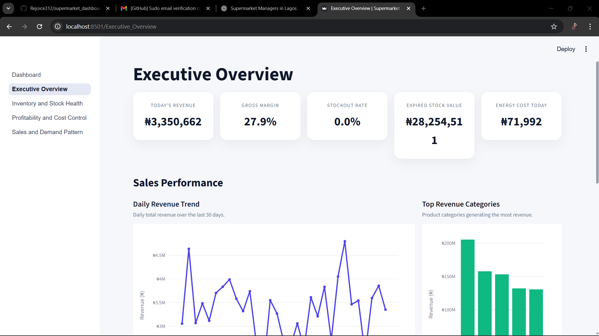
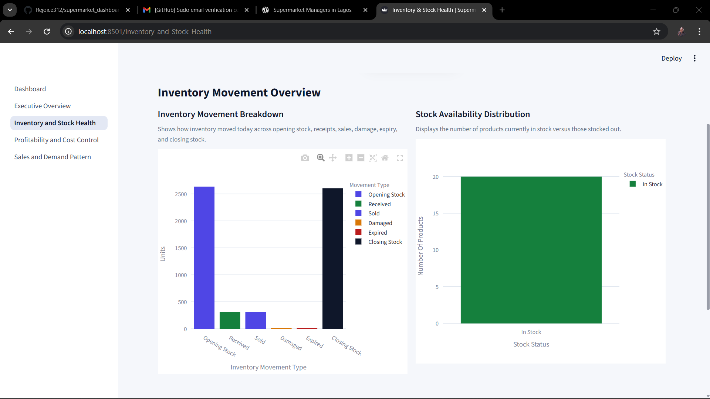
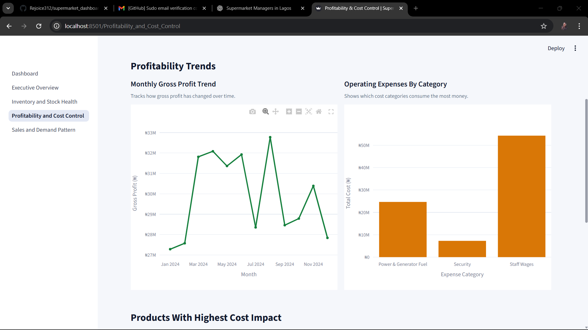
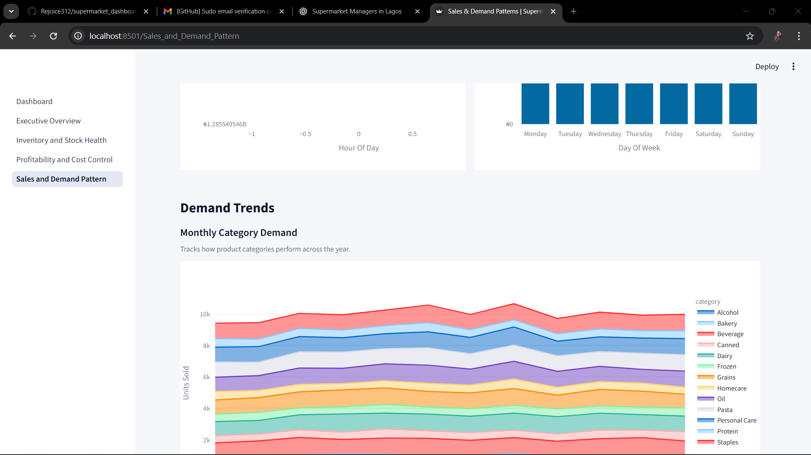

# Supermarket Business Intelligence Dashboard

A production-style, multi-page **Business Intelligence dashboard** built with **Streamlit, Plotly, and Python**, designed to address the real operational, inventory, and financial challenges faced by supermarket managers in Nigeria.

This project simulates **one full year of realistic supermarket operations data** and transforms it into actionable insights that support daily and strategic decision-making.

---

## Live Dashboard
Access the live interactive dashboard here:  
**https://supermarket-dashboard-app.streamlit.app/**

---

## Dashboard Preview

### Executive Overview

### Inventory Health & Stock Risk

### Cost & Profitability Analysis

## Sales & Demand Pattern

---

## Business Problems Addressed

Supermarket managers often struggle with:
- Limited visibility into daily business performance
- Frequent stockouts and overstocking
- Inventory losses from expiration and damage
- Rising operating costs (power, logistics, staffing)
- Difficulty linking operational data to profitability

This dashboard was built to **solve these problems through data**.

---

## Key Features

### Executive-Ready KPIs
- Daily revenue and revenue trends
- Gross margin and profitability indicators
- Stockout rate and expired stock value
- Energy and operating cost monitoring

### Inventory & Operations Intelligence
- Low-stock alerts with reorder visibility
- Inventory movement tracking (received, sold, damaged, expired)
- Stock risk identification before revenue loss occurs

### Clean BI-Style Design
- Multi-page layout with clear managerial focus
- Custom HTML + CSS for KPI cards and layout
- Consistent, light, executive-grade color theme
- Interactive Plotly charts optimized for readability

---

## Pages in the Dashboard

1. **Executive Overview**  
   One-glance view of overall business health and urgent risks.

2. **Inventory Health**  
   Stock movement, low-stock alerts, and inventory loss analysis.

3. **Sales Performance**  
   Revenue trends, category performance, and demand behavior.

4. **Costs & Profitability**  
   Operating expenses, energy costs, and margin drivers.

---

## Data

- Simulated **one-year operational dataset**
- Structured to mirror real supermarket systems:
  - Sales transactions
  - Daily inventory snapshots
  - Product master data
  - Operating expenses
- Stored in a multi-sheet Excel file for realism and portability

---

## Tech Stack

- **Python**
- **Streamlit** (multi-page app architecture)
- **Plotly** (interactive visualizations)
- **Pandas** (data modeling and KPI calculations)
- **HTML & CSS** (custom UI styling)
- **Excel (XLSX)** as data source

---

## Why This Project Stands Out

- Built around **real managerial questions**, not toy metrics
- Clean separation of data loading, logic, and presentation
- Demonstrates BI thinking, not just visualization skills
- Designed to scale to SQL databases or cloud data sources
- Suitable for executive demos and stakeholder presentations

---

## Author

**Rejoice Chinwendu**  
Data Analyst | Data Scientist | BI & Analytics  
Focused on building data products that drive operational and financial decisions

---

## Next Enhancements

- Role-based access (manager vs operations)
- Forecasting and demand prediction
- Supplier performance analytics
- Migration from Excel to SQL backend

